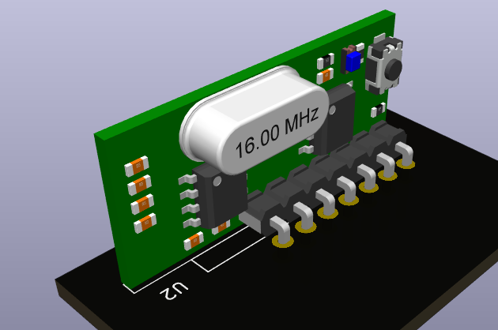

Radio Receiver Footprint
========================

## Installation

1. Open your project folder in a terminal
2. Now execute the following commands:

        $FOLDER=lib
        git submodule add https://github.com/besi/kicad-radio-receiver $FOLDER/radio-receiver
        git submodule sync
        
3. Now in Kicad in the schematic editor add the symbol library via **Preferences >> Manage Symbol Libraries**:

        Nickname:       radio-receiver
        Library Path:   ${KIPRJMOD}/lib/radio-receiver/radio-receiver.kicad_sym

4. Now in the layout editor add the footprint library via **Preferences >> Manage Footprint Libraries...**:

        Nickname:       radio-receiver
        Library Path:   ${KIPRJMOD}/lib/radio-receiver/radio-receiver.pretty

## Credits

3D Model by [Alejandro Hurtado](https://grabcad.com/alejandro.hurtado-5)

## Receiver

See [Product page](https://qiachip.com/products/2x-learning-code-receiver-module-for-rf-433mhz-rx-480-e-remote-control-arduino-chip-28131mm-pcb)

The Receiver is encoded with EV1527 and are ONLY compatible with Transmitter encoded with EV1527

Qiachip RX480E-4 Specifications:

[Receiver module ] Product Model: RX480E-4
Working Voltage : DC3.3~5V
Quiescent Current : ≤5mA
​Output current : 10 mA
Working Frequency: 433MHz( Others can be customized )
Receive Sensitivity: -108dB
Receive Distance: 15 meters above
Frequency band: ±0.2MHz
Working Temperature : -25~75

Pairing Instructions:

1. Delete existing data: Press learning button 8 times. Response: LED flashes 7 times.
2. Learning remote code: press learning key once, twice or three times (see below).
**LED turns on**: learning mode is active. Press any button of the remote control.
**LED indicator flashes three times**: learning successfully completed.
3. Test: after the above operation , the receiver board can be controlled by the remote control.

Functions:

- Press once: Inching mode (Momentary Mode)
- Press twice: self-Lock Mode (Toggle-Mode of the 4 Channels)
- Press three times: interlocked mode (selected channel active and be cleared, if another channel becomes active)

- GND : ground or negative pole
- +V : DC3.3~5V input
- D0: Data output
- D1: Data output
- D2: Data output
- D3: Data output
- VT: Output
